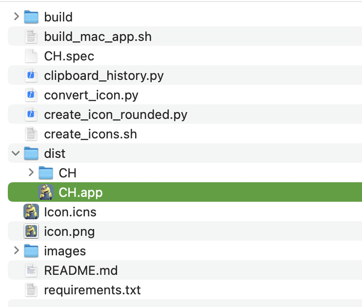

 
 
# CH ｜ Clipboard History ｜ 粘贴板历史
## 简介
CH是一个免费简单易用的粘贴板历史记录和管理工具，工具没有隐私声明，因为此工具获取的所有粘贴板工具，都存储在用户本地。

---

本地文件1:clipboard_settings 当前工具的配置文件

```bash
~/.clipboard_settings
```
---

本地文件2:clipboard_history 当前工具的粘贴板记录文件

```bash
~/.clipboard_history
```

✨ 功能特性
​​剪贴板历史管理​​：自动记录复制的文本和图片
​​智能排序​​：支持按时间/使用频率排序
​​项目固定​​：常驻重要内容不被新内容冲掉
​​即时搜索​​：快速定位历史记录
​​暗色/亮色模式​​：自动适应系统主题
​​置顶窗口​​：保持剪贴板历史始终可见
​​透明度调节​​：自定义窗口透明度

## 使用方法

从Release中下载最先的zip文件，解压后将`CH.app`移动到`/Applications/`目录，启动台点击启动应用即可。

## 自行打包的方法
### 1.下载项目
```bash
git clone https://github.com/WalkerXWJ/CH
```
### 2.安装依赖文件
```bash
pip install -r requirements.txt
```

### 3.打包项目
```bash
 pyinstaller --windowed --name "CH" --icon="Icon.icns" --exclude PyQt5 clipboard_history.py
```
### 4.将`CH.app`移动到`/Applications/`目录


启动台点击启动应用即可。